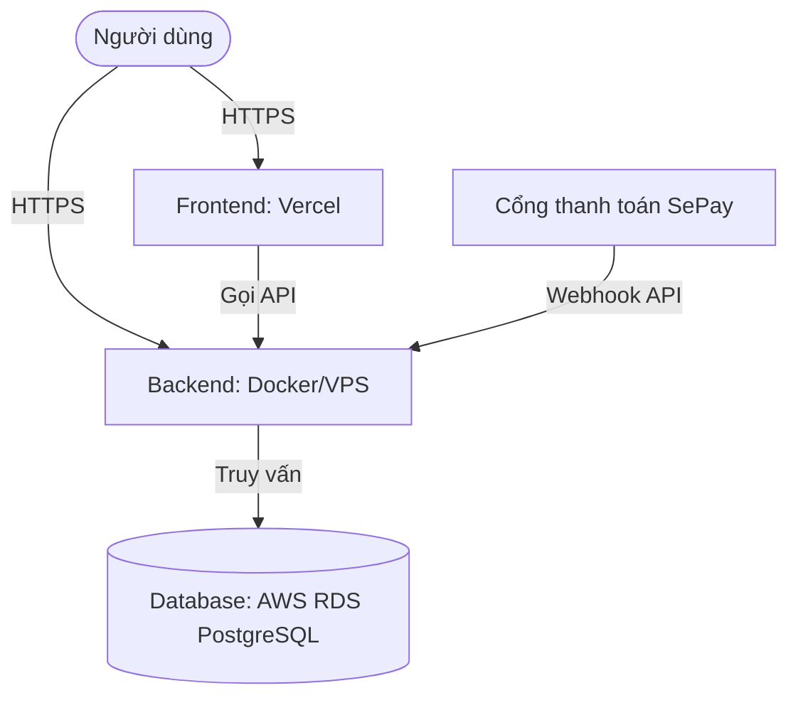

# Hướng dẫn cấu hình và triển khai dự án VivuPlan (Production)

Tài liệu này cung cấp hướng dẫn từng bước để bạn cấu hình và triển khai hệ thống VivuPlan lên môi trường thực tế (Production), bao gồm cấu hình Vercel (Frontend), VPS/EC2 (Backend + Database), Google OAuth, và cổng thanh toán SePay.

---

## 1. Mô hình kiến trúc triển khai



- **Frontend**: Triển khai trực tiếp lên **Vercel** (Serverless + CDN để tải trang cực nhanh).
- **Backend**: Đóng gói bằng **Docker** và chạy trên **VPS hoặc AWS EC2** (sử dụng Docker Compose).
- **Database**: Sử dụng dịch vụ cơ sở dữ liệu đám mây **AWS RDS (PostgreSQL)** để đảm bảo tính ổn định, bảo mật cao, tự động sao lưu dữ liệu và dễ dàng mở rộng độc lập với máy chủ chạy Backend.

---

## 2. Cấu hình Google OAuth (Đăng nhập Google)

Để tính năng đăng nhập Google hoạt động chính xác trên tên miền production mới của bạn:

### Các bước thực hiện:
1. Truy cập **Google Cloud Console** (https://console.cloud.google.com).
2. Chọn đúng dự án VivuPlan của bạn.
3. Đi tới **APIs & Services > Credentials** (API & Dịch vụ > Thông tin xác thực).
4. Nhấp vào Client ID của ứng dụng trong phần **OAuth 2.0 Client IDs**.
5. Cấu hình các tham số sau:
   - **Authorized JavaScript origins** (Nguồn gốc JavaScript được ủy quyền):
     - Thêm tên miền chính thức của bạn (ví dụ: `https://vivuplan.xyz`).
     - Thêm tên miền preview của Vercel (ví dụ: `https://vivuplan-fe.vercel.app`).
   - **Authorized redirect URIs** (URI chuyển hướng được ủy quyền): 
     - *Lưu ý*: Cơ chế đăng nhập của VivuPlan là lấy mã token trực tiếp từ phía client rồi gửi POST lên backend (`/api/auth/google`), do đó bạn không cần cấu hình Redirect URI cho backend. Chỉ cần khai báo chính xác tên miền ở mục **Authorized JavaScript origins** là đủ.
6. Lưu lại các cấu hình. Copy mã **Client ID** để điền vào phần biến môi trường.

---

## 3. Cấu hình cổng thanh toán SePay Webhook

Cổng thanh toán SePay cần biết chính xác địa chỉ Backend để gửi thông báo biến động số dư theo thời gian thực (real-time).

### Các bước thực hiện:
1. Đăng nhập vào **SePay Dashboard** (https://sepay.vn).
2. Đi tới mục **Tích hợp Webhook** và nhấp **Tạo mới Webhook**.
3. Cấu hình các thông số sau:
   - **Địa chỉ URL nhận Webhook (API URL)**: Trỏ trực tiếp đến API công khai của backend của bạn.
     - Định dạng: `https://<DOMAIN_BACKEND_CUA_BAN>/api/billing/sepay/webhook`
     - Ví dụ: `https://api.vivuplan.xyz/api/billing/sepay/webhook` (hoặc `http://<IP_VPS>:8080/api/billing/sepay/webhook` nếu chưa có tên miền).
   - **Loại dữ liệu gửi đi (Payload Type)**: Chọn **JSON**.
   - **Chữ ký bảo mật (Webhook Secret)**: Nhập một chuỗi ký tự ngẫu nhiên, dài và bảo mật (ví dụ: `MyVivuPlanSecret2026`). SePay sẽ dùng chuỗi này để tạo mã băm HMAC-SHA256 nhằm bảo mật thông tin.
4. Nhấp **Lưu cấu hình**.
5. Sao chép chuỗi **Chữ ký bảo mật (Webhook Secret)** để đưa vào cấu hình backend.

---

## 4. Cấu hình biến môi trường phía Backend (VPS / EC2)

Tạo tệp `.env` trong thư mục chạy `docker-compose.yml` trên VPS của bạn và cấu hình các biến dưới đây:

```env
# 1. Thông tin tài khoản Docker
DOCKER_USERNAME=tên_tài_khoản_docker_hub_của_bạn

# 2. Cấu hình Database (Kết nối trực tiếp tới AWS RDS)
# Định dạng: jdbc:postgresql://<rds-endpoint>:<port>/<db-name>
DB_URL=jdbc:postgresql://vivuplan-db.xxxxxx.ap-southeast-1.rds.amazonaws.com:5432/vivuplan
DB_USERNAME=postgres
DB_PASSWORD=mật_khẩu_rds_cực_kỳ_bảo_mật_của_bạn

# 3. Bảo mật ứng dụng
JWT_SECRET=chuỗi_bí_mật_tạo_token_phải_dài_hơn_32_ký_tự
JWT_EXPIRATION_MS=604800000

# 4. Địa chỉ CORS và Domain
CORS_ORIGINS=https://tên_miền_frontend_của_bạn.vn
APP_FRONTEND_URL=https://tên_miền_frontend_của_bạn.vn

# 5. Xác thực đăng nhập Google
GOOGLE_CLIENT_ID=mã_google_client_id_đã_lấy_ở_bước_2.apps.googleusercontent.com
GOOGLE_CLIENT_SECRET=mã_google_client_secret_nếu_có

# 6. Trợ lý AI Gemini
GEMINI_API_KEY=mã_gemini_api_key_của_bạn
GEMINI_MODEL=gemini-2.5-flash

# 7. Cấu hình SMTP (Để gửi mã OTP xác nhận tài khoản)
SMTP_HOST=smtp.gmail.com # Hoặc nhà cung cấp email của bạn
SMTP_PORT=587
SMTP_USERNAME=email_gửi_thư@gmail.com
SMTP_PASSWORD=mật_khẩu_ứng_dụng_email_của_bạn
SMTP_AUTH=true
SMTP_STARTTLS_ENABLE=true
SMTP_FROM=no-reply@tên_miền_của_bạn.vn
SMTP_FROM_NAME=VivuPlan

# 8. Cấu hình cổng thanh toán SePay
SEPAY_WEBHOOK_SECRET=chuỗi_chữ_ký_bảo_mật_đã_lập_ở_bước_3
SEPAY_QR_URL_TEMPLATE=https://qr.sepay.vn/img?bank={bank}&acc={account}&amount={amount}&des={description}&template=compact
SEPAY_BANK_CODE=mã_ngân_hàng_nhận_tiền (VD: VietinBank, MB...)
SEPAY_ACCOUNT_NUMBER=số_tài_khoản_ngân_hàng_của_bạn
SEPAY_ACCOUNT_NAME=tên_chủ_tài_khoản_viết_hoa_không_dấu
SEPAY_ORDER_PREFIX=VP

# 9. Tài khoản quản trị khởi tạo tự động (Bootstrap Admin)
# Bất kỳ ai đăng ký bằng email này lúc đầu đều tự động nhận quyền ADMIN để quản trị hệ thống.
ADMIN_BOOTSTRAP_EMAIL=admin_của_bạn@gmail.com
DATA_INITIALIZER_ENABLED=true
```

---

## 5. Cấu hình biến môi trường phía Frontend (Vercel)

Khi bạn triển khai dự án `vivuplan-fe` lên Vercel, hãy vào phần **Project Settings > Environment Variables** để thiết lập các biến sau:

| Tên biến | Giá trị khuyên dùng | Ghi chú |
| :--- | :--- | :--- |
| `NEXT_PUBLIC_API_URL` | `https://api.vivuplan.xyz` | **Cực kỳ quan trọng**: Phải dùng giao thức `https://`. Vì Vercel chạy HTTPS, nếu gọi sang backend chạy HTTP (`http://`) trình duyệt sẽ chặn cuộc gọi (lỗi Mixed Content). |
| `NEXT_PUBLIC_APP_NAME` | `VivuPlan` | Tên thương hiệu hiển thị trên thanh tiêu đề và email. |
| `NEXT_PUBLIC_APP_URL` | `https://vivuplan.xyz` | Tên miền chính thức của website. |
| `NEXT_PUBLIC_GOOGLE_CLIENT_ID` | `xxx.apps.googleusercontent.com` | Phải trùng khớp với Client ID đã dùng ở cấu hình Google và Backend. |

---

## 6. Cấu hình Nginx làm Reverse Proxy và SSL (HTTPS) cho Backend trên VPS

Vì Vercel chạy bắt buộc trên giao thức HTTPS, backend của bạn cũng cần cấu hình SSL (chạy trên HTTPS) để trình duyệt không chặn kết nối. Dưới đây là cấu hình mẫu Nginx và Certbot (Let's Encrypt):

### Bước 1: Cài đặt Nginx & Certbot trên VPS
```bash
sudo apt update
sudo apt install nginx certbot python3-certbot-nginx -y
```

### Bước 2: Tạo file cấu hình Nginx cho Backend
Tạo file cấu hình `/etc/nginx/sites-available/vivuplan-backend` với nội dung:
```nginx
server {
    listen 80;
    server_name api.vivuplan.xyz; # Thay thế bằng domain backend của bạn

    location / {
        proxy_pass http://127.0.0.1:8080; # Chuyển tiếp tới cổng Spring Boot chạy trên VPS
        proxy_set_header Host $host;
        proxy_set_header X-Real-IP $remote_addr;
        proxy_set_header X-Forwarded-For $proxy_add_x_forwarded_for;
        proxy_set_header X-Forwarded-Proto $scheme;
    }
}
```

Kích hoạt cấu hình và restart Nginx:
```bash
sudo ln -s /etc/nginx/sites-available/vivuplan-backend /etc/nginx/sites-enabled/
sudo nginx -t
sudo systemctl restart nginx
```

### Bước 3: Cấu hình chứng chỉ SSL HTTPS miễn phí bằng Certbot
Chạy lệnh sau và làm theo hướng dẫn trên màn hình để sinh chứng chỉ SSL tự động:
```bash
sudo certbot --nginx -d api.vivuplan.xyz
```
Certbot sẽ tự động cấu hình lại Nginx để chuyển hướng toàn bộ lưu lượng HTTP sang HTTPS và cài đặt chứng chỉ bảo mật có thời hạn tự động gia hạn.

---

## 7. Khởi động Backend trên VPS
Sau khi hoàn tất cấu hình tệp cấu hình `.env` và Nginx trên VPS, bạn chỉ cần gõ lệnh sau để khởi động hệ thống:
```bash
# Kéo phiên bản backend mới nhất từ Docker Hub về
docker compose pull

# Khởi chạy ứng dụng chạy ngầm
docker compose up -d
```
Kiểm tra trạng thái container đang hoạt động:
```bash
docker compose ps
```
Cơ sở dữ liệu sẽ tự động tạo bảng (JPA Ddl-auto) và tạo tài khoản Admin dựa vào `ADMIN_BOOTSTRAP_EMAIL` khi bạn đăng ký lần đầu tiên.
